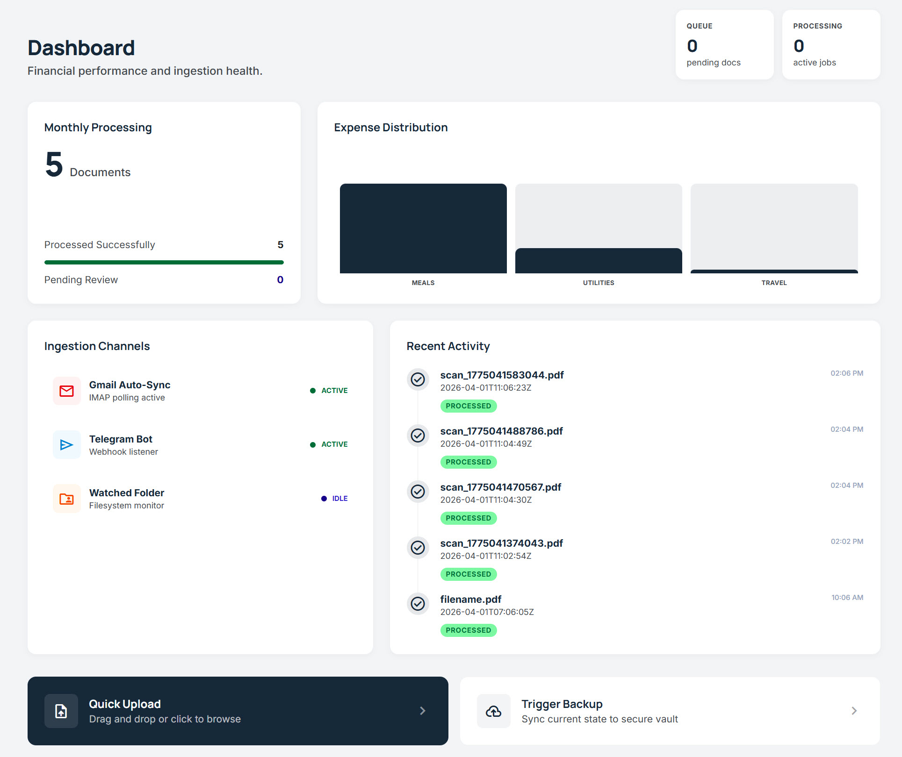

# Receiptory

**Self-hosted receipt, invoice, and document management for self-employed professionals.**

Receiptory is a single-container web application that ingests receipts and invoices from multiple channels — web upload, email, Telegram, mobile camera, or a watched folder — and uses LLM-powered extraction to automatically classify, parse, and organize them. Built for running on a home NAS or any Docker host.


---

## Screenshots

| Dashboard | Document Browser |
|:---------:|:----------------:|
|  |  |

| Document Detail | Administration |
|:---------------:|:--------------:|
|  |  |

| Dark Mode |
|:---------:|
|  |

---

## Features

**Ingestion**
- Drag-and-drop web upload with SHA-256 deduplication
- Mobile document scanner with live boundary detection and perspective correction
- Telegram bot — forward photos or documents for automatic processing
- Gmail IMAP polling — auto-ingests receipts from labeled emails
- Watched folder — drop files on a network share for hands-free ingestion

**Processing**
- LLM-powered extraction via [litellm](https://github.com/BerriAI/litellm) (Gemini, OpenAI, Anthropic, and more)
- Single-pass OCR, field extraction, and classification
- Automatic vendor detection, amount parsing, tax ID matching
- Confidence scoring with human review queue for uncertain extractions

**Management**
- Document browser with full-text search (SQLite FTS5), filters, sorting, and pagination
- Document detail view with rendered page images and editable metadata
- Custom categories with LLM-guided classification (see [sample categories](#sample-categories))
- Export to ZIP with category-organized PDFs, CSV, and Excel metadata

**Infrastructure**
- Cloud backup to Google Drive and/or OneDrive via OAuth (or any rclone remote)
- Configurable retention policy (daily/weekly/monthly/quarterly)
- Dark theme with light/dark/system toggle
- Notification alerts via Telegram and email
- Single-user session auth

---

## Sample Categories

Receiptory ships with a default set of categories. You can customize them freely — category descriptions are fed into the LLM prompt to guide automatic classification.

| Category | Description |
|----------|-------------|
| Office & Supplies | Office supplies, stationery, printer ink, small equipment |
| Subscriptions & Software | SaaS, software licenses, cloud services, streaming, gym, memberships |
| Hardware & Equipment | Computers, monitors, phones, peripherals, furniture |
| Travel | Flights, trains, taxis, public transport, tolls, parking |
| Car Fuel | Gasoline, diesel, EV charging |
| Car Maintenance | Vehicle repairs, servicing, tires, car wash, registration, insurance |
| Accommodation | Hotels, Airbnb, lodging for business trips |
| Meals & Entertainment | Business meals, client dinners, coffee meetings |
| Groceries | Supermarket, food, household consumables |
| Clothing | Clothes, shoes, accessories |
| Home & Garden | Home repairs, maintenance, appliances, garden supplies |
| Communication | Phone plans, internet service, SIM cards |
| Professional Services | Accountant, lawyer, consultant, freelancer fees, translation services |
| Insurance | Business insurance, professional liability, health insurance |
| Education & Training | Courses, conferences, books, certifications, professional development |
| Marketing & Advertising | Online ads, print ads, promotional materials, business cards, website costs |
| Rent & Workspace | Office rent, coworking space, home office expenses |
| Banking & Finance | Bank fees, payment processing fees, currency exchange, credit card fees |
| Taxes & Government | Tax payments, license fees, permits, government charges, municipal fees |
| Medical | Health-related expenses |
| Children & Family | Childcare, school fees, kids activities, baby supplies |
| Pets | Vet visits, pet food, grooming |
| Donations & Gifts | Charitable donations, gifts |
| Personal | Personal purchases not related to business activity |
| Utilities | Electricity, water, gas, waste disposal |
| Shipping & Delivery | Courier, postal services, package delivery, customs fees |
| Other | Expenses that don't fit any other category |

---

## Quick Start

```bash
git clone https://github.com/LevMuchnik/Receiptory.git
cd Receiptory
cp .env.example .env
# Edit .env — at minimum set RECEIPTORY_LLM_API_KEY

docker compose up -d --build
```

Open `http://localhost:8484`. Log in with `admin` / `admin`, then change the password in **Administration > General**.

---

## Unraid Setup

### Installation

1. Open the Unraid terminal (or SSH into your server)

2. Clone and configure:
   ```bash
   mkdir -p /mnt/user/appdata/Receiptory
   cd /mnt/user/appdata/Receiptory
   git clone https://github.com/LevMuchnik/Receiptory.git .
   cp .env.example .env
   nano .env
   ```

3. Set at minimum:
   ```env
   RECEIPTORY_LLM_API_KEY=your-api-key-here
   RECEIPTORY_LLM_MODEL=gemini/gemini-3-flash-preview
   RECEIPTORY_AUTH_USERNAME=admin
   RECEIPTORY_AUTH_PASSWORD=your-password
   RECEIPTORY_PORT=8484
   ```

4. Build and start:
   ```bash
   docker compose up -d --build
   ```

5. Open `http://your-nas-ip:8484`

### Updating

```bash
cd /mnt/user/appdata/Receiptory
git pull
docker compose up -d --build
```

### Data Persistence

All data lives in `data/` (mounted as a Docker volume) and survives container rebuilds:

| Path | Contents |
|------|----------|
| `data/receiptory.db` | SQLite database |
| `data/storage/` | Document files (originals, converted, filed) |
| `data/logs/` | Application logs |
| `data/rclone.conf` | Cloud backup credentials (auto-generated) |

---

## Configuration

All settings are configurable via the admin UI. Environment variables take precedence over database values.

| Variable | Default | Description |
|---|---|---|
| `RECEIPTORY_LLM_API_KEY` | — | API key for your LLM provider (required) |
| `RECEIPTORY_LLM_MODEL` | `gemini/gemini-3-flash-preview` | [litellm model string](https://docs.litellm.ai/docs/providers) |
| `RECEIPTORY_AUTH_USERNAME` | `admin` | Web UI username |
| `RECEIPTORY_AUTH_PASSWORD` | `admin` | Web UI password |
| `RECEIPTORY_SECRET_KEY` | (random) | Session signing key — set for persistent sessions across restarts |
| `RECEIPTORY_PORT` | `8484` | HTTP port |
| `RECEIPTORY_DATA_DIR` | `./data` | Data directory (DB, files, logs) |
| `RECEIPTORY_TELEGRAM_BOT_TOKEN` | — | Telegram bot token from @BotFather |
| `RECEIPTORY_GMAIL_ADDRESS` | — | Gmail address to poll via IMAP |
| `RECEIPTORY_GMAIL_APP_PASSWORD` | — | Gmail App Password (16 chars) |
| `RECEIPTORY_BACKUP_SCHEDULE` | `0 2 * * *` | Backup cron schedule |
| `RECEIPTORY_THEME` | `light` | Default theme: `light`, `dark`, or `system` |
| `RECEIPTORY_DEV` | `0` | Set to `1` when running with Vite dev server |

See `.env.example` for the full list with descriptions.

---

## Ingestion Channels

### Telegram Bot

1. Message [@BotFather](https://t.me/BotFather) on Telegram, send `/newbot`
2. Copy the bot token to `.env` as `RECEIPTORY_TELEGRAM_BOT_TOKEN` (or set via Administration > Telegram)
3. Restart the container
4. Optionally restrict access by adding your Telegram user ID (message [@userinfobot](https://t.me/userinfobot) to find it)
5. Send or forward photos/documents to your bot

### Gmail

Uses IMAP with a Gmail App Password — no Google Cloud project needed.

1. Enable 2-Step Verification: [myaccount.google.com/security](https://myaccount.google.com/security)
2. Generate an App Password: [myaccount.google.com/apppasswords](https://myaccount.google.com/apppasswords)
3. In Administration > Email, enter the Gmail address and App Password
4. Click **Test Connection** to verify

Unread emails with PDF/image attachments are ingested automatically. HTML-only emails (e.g., digital receipts) are converted to PDF. Emails from unauthorized senders are flagged for review.

### Mobile Scanner

On Android devices, the app opens directly to a camera-based document scanner with:
- Live document boundary detection and perspective correction
- Image enhancement (contrast, brightness optimization)
- Multi-page scanning with PDF assembly
- Requires HTTPS or a Chrome flag for camera access on LAN

### Watched Folder

Set `RECEIPTORY_WATCHED_FOLDER_PATH` to a directory. Files dropped there are auto-ingested and moved to a `processed/` subfolder.

---

## Cloud Backup

Receiptory backs up to Google Drive and/or OneDrive via OAuth. Both can be active simultaneously. Backups are scheduled via cron and include the database, all document files, and metadata exports (JSONL + CSV + Excel).

### Google Drive

1. Go to [Google Cloud Console > Credentials](https://console.cloud.google.com/apis/credentials)
2. Create a project if needed, then **+ Create Credentials > OAuth client ID**
3. Configure consent screen (External), select **Web application**
4. Add redirect URI: `http://your-nas-ip:8484/api/cloud-auth/callback/gdrive`
5. Copy Client ID and Secret
6. Enable the [Google Drive API](https://console.cloud.google.com/apis/library/drive.googleapis.com)
7. In Receiptory: Administration > Resilience > paste credentials > **Connect Google Drive**

### OneDrive

1. Go to [Azure Portal > App registrations](https://portal.azure.com/#view/Microsoft_AAD_RegisteredApps)
2. **+ New registration** — select "Accounts in any organizational directory and personal Microsoft accounts"
3. Add redirect URI (Web): `http://your-nas-ip:8484/api/cloud-auth/callback/onedrive`
4. Copy Application (client) ID
5. Under Certificates & secrets, create a new secret and copy the **Value**
6. Under API permissions, add: `Files.ReadWrite.All`, `User.Read`, `offline_access`
7. In Receiptory: Administration > Resilience > paste credentials > **Connect OneDrive**

### Retention Policy

| Type | Schedule | Default Retention |
|------|----------|-------------------|
| Daily | Every day | 7 days |
| Weekly | Sundays | 4 weeks |
| Monthly | 1st of month | 3 months |
| Quarterly | Jan/Apr/Jul/Oct 1st | Never deleted |

Configurable in Administration > Resilience > Backup Schedule.

---

## Development

### Prerequisites

- Python 3.12+, [uv](https://docs.astral.sh/uv/)
- Node.js 20+

### Backend

```bash
uv sync --all-extras
RECEIPTORY_DEV=1 uv run uvicorn backend.main:create_app --factory --reload --port 8484
```

### Frontend

```bash
cd frontend && npm install && npm run dev
```

The Vite dev server runs on port 5173 with API proxy to localhost:8484. Set `RECEIPTORY_DEV=1` to prevent the backend from serving static files.

### Tests

```bash
uv run pytest tests/ -v
```

### Production Build

```bash
cd frontend && npm run build && cd ..
uv run uvicorn backend.main:create_app --factory --host 0.0.0.0 --port 8484
```

---

## Project Structure

```
receiptory/
├── backend/
│   ├── main.py                # FastAPI app factory, lifespan
│   ├── config.py              # Settings (env > db > defaults)
│   ├── auth.py                # Session-based authentication
│   ├── database.py            # SQLite WAL + migration runner
│   ├── storage.py             # File I/O, page rendering
│   ├── models.py              # Pydantic request/response models
│   ├── api/                   # REST endpoint routers
│   ├── processing/            # LLM extraction pipeline, queue
│   ├── ingestion/             # Telegram bot, Gmail poller, watched folder
│   ├── backup/                # Scheduler, runner, rclone, OAuth
│   └── notifications/         # Telegram + email notification dispatch
├── frontend/src/
│   ├── pages/                 # Page components
│   ├── components/            # Reusable UI components
│   ├── components/scanner/    # Mobile document scanner
│   ├── contexts/              # Auth + Theme providers
│   └── lib/                   # API client, hooks, utilities
├── migrations/                # Numbered SQL migration files
├── tests/                     # pytest test suite
├── Dockerfile                 # Multi-stage build
└── docker-compose.yml
```

---

## Tech Stack

| Layer | Technology |
|-------|-----------|
| Backend | Python 3.12, FastAPI, SQLite (WAL + FTS5), litellm |
| Frontend | React 18, TypeScript, Vite, Tailwind CSS v4, shadcn/ui |
| Document processing | PyMuPDF, Pillow, WeasyPrint |
| Mobile scanner | Scanic (WASM), jsPDF |
| Cloud backup | rclone (Google Drive, OneDrive, S3, etc.) |
| Deployment | Docker Compose, single container |

---

## License

This project is licensed under the [GNU Affero General Public License v3.0](LICENSE).
