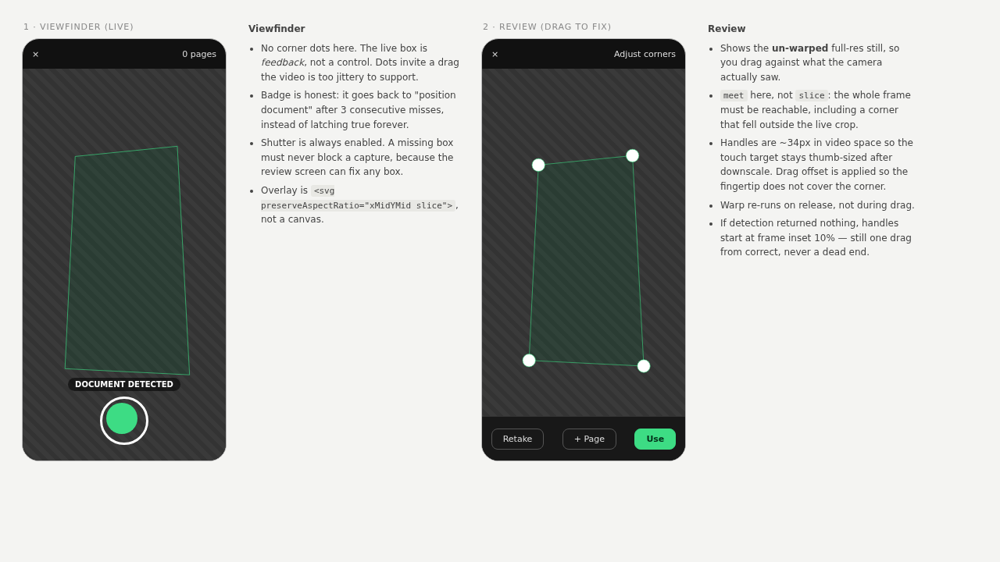

# Design: Mobile Scanner — Fix the Window, Then Measure

Generated by /office-hours on 2026-09-04, hardened by /plan-eng-review the same day
Branch: master
Repo: LevMuchnik/Receiptory
Status: APPROVED
Mode: Builder
Supersedes: `~/.gstack/projects/LevMuchnik-Receiptory/root-master-design-20260703-134251.md` (not in-repo; the ML-detector design whose gate failed)

## Problem Statement

The mobile-browser scanner is virtually unusable. The owner wants dynamic auto-detection with a live bounding box that holds up across real conditions (cluttered desk, dark leather, harsh shadow, crumpled long thermal receipts) plus a capture that actually delivers a usable image. Reference device is a Galaxy S26 Ultra. Everything stays self-hosted and offline-capable.

The prior design bet on swapping in pretrained DocAligner corner-heatmap models. Its own gate killed it: median IoU 0.099 / 0.062 over the 31 labeled frames, with heatmap peak ≈ 0.00 on roughly 20 of 31 — the model is blind on curled thermal receipts, not mislocalizing.

This design does not pick a new model. It repairs the instrument you have been measuring with, widens the pipe that carries pixels to the LLM, adds the interaction that makes detector accuracy optional, and produces the baseline number every future model decision needs.

### The core diagnosis

Eight defects, all verified in source. The first is the one that matters most; the last two were found by eng review.

**1. The overlay draws the quad in the wrong place — horizontally.** `CameraViewfinder.tsx:83-84` maps detection coordinates to the overlay canvas with independent X and Y scale factors and no crop offset, while the `<video>` renders with CSS `object-cover` (`:148`).

For a 9:19.5 viewport over a 9:16 portrait stream, `object-cover` picks `s = boxH / videoHeight`, so the existing `scaleY = boxH / detH` is **exactly correct** and the vertical offset is zero. The error is purely horizontal: `boxW/videoWidth = 0.820 × s`, so **the quad is squeezed to 82% of its true width and anchored at x = 0** — correct at the left edge, worst at the right.

Caveat that changes how you verify the fix: Android often hands back a **landscape-oriented track (1920×1080) under a portrait UI**, which flips which axis `object-cover` crops and makes the error vertical instead. The `slice` fix handles both orientations automatically, but the *check* must cover all four edges — see Success Criterion 1.

This is the window through which "virtually unusable" was judged, and through which "it was much better before" was judged on 2026-07-02, the verdict that reverted full-resolution capture within a day. Scope note: this corrupted *subjective on-device verdicts only*. `ScannerLabPage.runEval` computes IoU against stored ground truth and never touches this overlay, so fixing it will not move the Lab's numbers.

**2. The box never lets go.** `smoother.ts:43-46` early-returns on a null detection without clearing `this.ema`. The last quad persists forever, `documentDetected` stays true forever, and the drift-reject at `:50-54` then rejects any new quad more than 15% of the frame diagonal away — so the box can permanently lock onto a stale ghost while the badge insists a document is detected.

**3. Per-frame waste on the main thread.** `overlay.width = overlay.clientWidth` at `:76-77` reallocates the canvas backing store every rAF frame (~60Hz), in CSS pixels rather than device pixels. The `offscreen` resize and `getContext` at `:43-45` run per detection, as does a `getImageData` without `willReadFrequently`.

The dominant cost is `preprocess` (`classical-detector.ts:49`): `grayscaleAsRgba` → `canvasBlur` (two canvases plus a `getImageData`) → shadow-normalize loop → `saturationMask` → `composeWeighted` → `imageDataToCanvas` — five per-pixel JS passes and two canvas round-trips, on the UI thread. Blur radius at defaults is `width × 0.125` ≈ 54px, and that single filter is the hot spot.

**4. Capture warps to a stale quad.** `CameraViewfinder.tsx:127` passes `cornersRef.current`, the EMA (α=0.4, ~200ms of lag), applied to a frame grabbed *after* the shutter tap moved the phone.

**5. The detection scale is duplicated across two files.** `DETECTION_SCALE` at `CameraViewfinder.tsx:13` and the `detectionScale = 0.4` default at `opencv-loader.ts:52`.

**6. Capture resolution is preview resolution.** 1080p, so a receipt filling half the frame reaches the LLM at roughly 500×900px.

**7. The PDF pipe throws the pixels away before the model sees them.** `pdf-builder.ts:9` hardcodes `format: "a4"` with 5mm margins (200×287mm content). A 1:3 receipt takes the height-constrained branch at `:30-31`: `drawW = 287 × 0.333 = 95.6mm`. At `page_render_dpi = 200` (`config.py:29`, consumed at `pipeline.py:54`) that is **≈753px wide at the model, regardless of capture resolution**. Today's ~500px crop is being *upscaled* to it; a 4K crop would be downsampled to it. Defect 6 cannot be fixed without fixing this first.

**8. A failed Scanic init latches permanently.** `opencv-loader.ts:12-13` assigns `scanner = new Scanner(...)` **before** `await scanner.initialize()`. If init throws, `scanner` is non-null and half-built, so every later `initScanner()` returns immediately at `if (scanner) return` (`:9`), and `initPromise` is never nulled on rejection. Only the "Try Again" button's `terminateScanner()` clears it.

### The structural finding, stated precisely

`ClassicalDetector.detect` passes only `{mode:"detect"}` to Scanic (`classical-detector.ts:55`), and Scanic returns one contour, so `candidates` is a length-≤1 literal (`:71`, `:80`) with no ranking.

Restricted to the ten geometry and scoring params: `wArea`/`wConvex`/`wUniform`/`wText` feed only `metrics.score` (`:240-248`), which never gates anything, and `passesHardRejects` (`:252-258`) uses the geometry params plus a hardcoded `convexity < 0.85`. **Those ten can only turn a detection off. They can never find one Scanic missed.**

The other four — `shadowNorm`, `shadowBlurFraction`, `saturationPrior`, `saturationWeight` — reach `preprocess()` and rewrite the image Scanic sees, so they genuinely can produce a detection that would otherwise be missed. `ScannerLabPage.tsx:59` seeds Panel B by flipping `shadowNorm` off precisely to A/B this. **The preprocessing four stay a live tuning surface; only the scoring ten are inert.**

## What Makes This Cool

The fix for defect 1 is `<svg viewBox="..." preserveAspectRatio="xMidYMid slice">`. `slice` *is* object-cover semantics; the browser owns the crop math and the overlay cannot drift out of sync with the CSS. It replaces the canvas entirely, killing defect 3's 60Hz reallocation, and renders GPU-composited at device pixel ratio for free. Roughly 40 lines, and it is the highest value-per-line change in the project.

## Coordinate spaces

Four spaces are in play. Confusing two of them is the bug this whole document exists to fix. This diagram is duplicated as a header comment in `detector.ts`.

```
  DETECTION SPACE                    ~800px longest edge (was 432x768)
    Detector.detect() operates here
    ClassicalParams are tuned here
    blur radius = width * 0.125, so cost scales with this
        |
        |  x (videoW / detW)          <- converted at the detector boundary
        v
  VIDEO SPACE                        1080x1920 (or 1920x1080, see defect 1)
    onCapture(imageData, corners)    <- corners cross HERE, in video pixels
    scanic.extract() consumes this
    CaptureReview { raw, corners }
        |
        |  <svg preserveAspectRatio="xMidYMid slice">   viewfinder
        |  <svg preserveAspectRatio="xMidYMid meet">    review
        v
  SCREEN SPACE                       CSS px
    THE BROWSER OWNS THIS.
    Never compute cover-scale by hand again. That was defect 1.

  STORED SPACE                       1280px longest edge, JPEG q0.85
    test-frame-upload.ts downscales on upload
    ground_truth_json is normalized 0-1
    corners_at_capture_json MUST be normalized 0-1 too (it is not today)
    runEval() denormalizes against the LOADED image dims, not stored metadata
```

## Constraints

- Self-hosted and offline. No CDN at runtime.
- Single-user home-NAS deployment, Docker Compose, one container.
- On-device feel is the gate. Reference device is the S26 Ultra. This is the lesson of the 2026-07-02 revert.
- Receipts are not A4. Long thermal receipts run to ~5:1 aspect and curl; four corners are sometimes not well-defined.
- No auto-capture. Shutter stays manual.

## Premises

**P1.** A large share of the felt unusability is plumbing, not detector accuracy. Fix it first, or on-device judgement stays unreliable. Scoped: subjective verdicts only, not the Lab's IoU metric, which the overlay never touched.

**P2 (revised).** Heatmap abstention masked *why* DocAligner failed. Testing point-regression variants is worth doing, but only diagnostic with controls: a fixed center box at the corpus mean ground truth, and inter-frame variance of the predicted quad. Supporting detail: `ml-detector.ts:171` hardcodes `score: 1.0` for the regression path, so `scoreThreshold` cannot reject a regression output at all.

**P3.** The cheapest next experiment is the multi-arm run on the existing corpus.

**P4 (bounded).** Coarse ML plus classical edge refinement beats either alone, but only as a *bounded* refinement along the two long side edges.

**P5 (verified, with a hard caveat).** Capture resolution is fixable without `ImageCapture.takePhoto()`. Verified in `frontend/node_modules/scanic/dist/scanic.js`: `maxProcessingDimension: 800` (`:1352`) gates only `prepareScaleAndGrayscale`; `extractDocument` calls `unwarpImage` against the original (`:1320`), sizing output from corner distances in original-image pixels (`:1151-1160`). The unwarp is a 64×64 grid of GPU `drawImage` calls, so it scales acceptably.

**Caveat that reverses the plan's original instruction.** An earlier draft of this document said "do not write a constraint ladder; `ideal` is soft and never rejects." That is a true spec fact and the wrong conclusion for this hardware. Git, on this exact device:
- `9dcd7b7` — "Galaxy S26 Ultra rejects the environment+1080p request outright with **NotReadableError** ('Couldn't start video source')." A three-rung ladder was added *because of it*.
- `b27a868` — `ideal 9999x9999` "made getUserMedia hang / return a **non-producing track**", so `ready` never flipped and the viewfinder stuck on a black spinner.

`ideal` does not reject on *resolution*, but the OS still throws when it cannot start a source, and a hung track throws nothing at all. Both need handling. See step 7.

**P6.** Classical's baseline must be measured before anything can be called better. Verified against `data/receiptory.db`: 40 frames total, 31 with `ground_truth_json`, of those only 3 with `corners_at_capture_json`. `ScannerLabPage.runEval` (`:158-195`) is detector-agnostic and computes median IoU, hit@0.85 and median timing.

**P7 (new, from eng review).** More capture pixels are worthless until the PDF pipe widens. See defect 7. Fix `pdf-builder` first and re-measure before spending any risk on the camera.

## Cross-Model Perspective

Three independent reviews fed this document: one fresh-context read during office hours, two adversarial spec reviews, and an outside-voice plan challenge during eng review. Adopted contributions:

- **The KPI reframe.** "The scanner is not a computer-vision product, it's the ingest funnel for an LLM extraction pipeline, and its only real KPI is pixels-per-character delivered to the model per second of user attention. Detection accuracy is a comfort feature that reduces how often you drag; it is not the product." Defect 7 is what happens when you adopt that KPI and never audit the pipe.

- **P2's challenge.** Peak ≈ 0.00 on 20/31 frames is a statement about the *backbone*, not the output head. DocAligner's regression variants share the backbone and training distribution.

- **The SVG `slice` fix**, strictly better than computing cover-scale in JS.

- **Defects 4, 5, 7 and 8**, and the structural finding, all came from outside voices.

- **Where an outside voice overreached, and the counter-evidence.** It argued `quadIoU` → `polygonClip` (`ScannerLabPage.tsx:745-775`) is winding-sensitive (`isLeft >= 0`), so the DocAligner verdict might be an artifact. Winding-sensitivity is real; the conclusion is not. The spike recorded that every frame with heatmap peak ≥ 0.9 scored **IoU 0.91-0.96** — if winding were inverted those frames would have scored 0, not 0.94. The high-peak frames empirically validate the winding. The verdict stands. A `quadIoU(gt,gt) === 1` assertion is still added as a regression guard.

- **Where this design disagrees.** One voice recommended skipping all pretrained ML. The backbone argument disqualifies *document-trained* models specifically. Generalist salient-object backbones never learned "document," they learned "the salient thing on the surface." Preserved as Approach C.

## Approaches Considered

### Approach A: Fix the window, then measure — CHOSEN
Repair the defects, widen the PDF pipe, add draggable corner handles, then run the Lab eval. Split into three increments (see Next Steps).
Effort: M-L (human ~4 days / CC ~7h plus on-device passes) · Risk: Low-Med · Completeness: 9/10

### Approach B: Own the detector — DEFERRED, not rejected
Train a MobileNetV3-Small, 128×128, 8-coordinate regression model (~1-2MB ONNX) on synthetically composited receipts: flat cutouts × backgrounds × perspective homography × **cylindrical curl deformation** × shadow gradients × blur/JPEG. Curl is the exact class no pretrained document model has seen, and it is the dominant failure bucket. Genius Scan's published lesson is that synthetic data, not architecture, drove 75% → 85%.
Effort: L · Risk: Med · Completeness: 10/10
Prerequisite corpus growth to ~120 stratified frames belongs to B. Capture opportunistically; do not gate A on it.

### Approach C: Salient object, not document — HELD
Generalist SOD model (u2netp ~4.7MB, ISNet), mask → largest component → contour → quad fit. Structurally immune to the backbone argument. Risk: picks the *most* salient object, which on a cluttered desk may be a coffee mug. Not a cheap eval arm — needs a new `Detector` with contour-to-quad fitting plus a self-hosted ONNX. Half a day minimum.

### Rejected during eng review
- **`<input type="file" capture="environment">` as the primary scanner** — gives no live bounding box, which is the stated requirement. Adopted as a *fallback* instead (step 0.3).

## Recommended Approach

**Approach A, in three increments.** The overlay defect means every on-device verdict in this project's history was read through a distorted window, and re-running that mistake with a better model produces a better-informed wrong answer. The increments exist so that each on-device verdict is attributable to one change — the failure mode that killed PR #8, where a resolution change and a detection change landed together and the whole thing was reverted in a day.

## Success Criteria

1. **The box lands where the receipt is.** On the S26 Ultra in portrait, the drawn quad coincides with the receipt at **all four edges**. Not just the centre, and not just left/right: Android may hand back a landscape-oriented track, which moves the error to the vertical axis. Checking one axis can pass a broken build.
2. **The box lets go.** Losing the receipt returns the badge to "position document" within ~250ms, and re-framing re-locks.
3. **No scan is ever lost.** Every capture reaches a usable crop — from detection, from at most two corner drags, or from the "use full frame" escape. No review state is a dead end.
4. **Pixels reach the model.** Measured end-to-end, not at the camera: the same receipt, re-scanned after Increment 0, yields a visibly sharper page render at `page_render_dpi`. Record `track.getSettings()` too; if the browser caps at 1080p that answers open question 1 rather than failing the work.
5. **A baseline number exists**, recorded in the Baseline Results table with its detection resolution.
6. **Shutter latency unchanged.** No regression against the current instant grab. **This criterion gates Increments 1 and 2 both** — Increment 1 adds shutter-path work (step 4), and `1c828d5` named "corner re-detection on the still" as half of what made PR #8 worse.
7. **The camera always starts, or says why.** No infinite black spinner. A failed or hung `getUserMedia` surfaces a retriable error within ~7s.

## Distribution Plan

Existing pipeline covers this. Frontend-only plus one backend setting; Docker Compose build and `up -d` from the claude-dev sidecar, no CI/CD. No new runtime assets. Step 8b's DocAligner ONNX is a Lab-only artifact, not shipped to the scanner path.

## Next Steps

### INCREMENT 0 — widen the pipe (no camera code)

Cheapest, highest-leverage, and it may make Increment 2 unnecessary. Nothing here touches `getUserMedia`.

**0.1 Size the PDF page to the image.** `pdf-builder.ts:9` — replace `format: "a4"` with `format: [wMm, hMm]` computed from the image and the target DPI (`wMm = img.width / dpi * 25.4`), so pixels survive the round trip instead of being letterboxed into 95.6mm. Keep A4 for nothing; a receipt PDF has no reason to be A4.

**0.2 Re-measure end-to-end.** Same receipt, before and after: compare what the LLM extracts. Consider raising `page_render_dpi` (`config.py:29`) if the render is still the binding constraint. **This measurement decides whether Increment 2 happens at all.**

**0.3 Native camera fallback.** `<input type="file" accept="image/*" capture="environment">` wired to the existing `api.upload`, surfaced in `ScannerNav` and on the `WebViewWarning` screen — which today (`ScannerPage.tsx:130`) is a dead end with no way to scan at all. ~20 lines. Full sensor, real autofocus, HDR, zero coordinate math, and an escape hatch whenever the scanner misbehaves.

### INCREMENT 1 — detection usability

Files: `CameraViewfinder.tsx`, `smoother.ts`, `useScanner.ts`, `ScannerPage.tsx`, `CaptureReview.tsx`, plus new `canvas-utils.ts` / `geometry.ts` and the vitest suite. Delivers criteria 1, 2, 3 — and is gated by criterion 6.

**1.1 Replace the overlay canvas with SVG.**
```
<svg viewBox="0 0 {detW} {detH}" preserveAspectRatio="xMidYMid slice">
```
- `detW/detH` are **detection-space** dimensions, matching `cornersRef.current` (`CameraViewfinder.tsx:43-44,:55`). Using raw video dimensions instead reproduces a 2.5x scale error.
- Set **both** `viewBox` and `points` imperatively (`svgRef.current.setAttribute(...)`, `polygonRef.current.setAttribute("points", ...)`) inside the existing loop. Dimensions are unknown until `videoWidth > 0` and become dynamic under step 5. Imperative updates preserve the zero-re-render property `cornersRef` exists for.
- `vector-effect="non-scaling-stroke"` on the polygon; scale circle `r` from `detH` rather than hardcoding.
- Valid as long as the video keeps default `object-position: 50% 50%`.

**1.2 Make the smoother let go.** Two rules, stated precedence:
- Reset after **2 consecutive drift-rejects** (~170ms) — primary; fires in the ghost-lock case where `push` is still receiving valid-but-rejected quads.
- Reset after **250ms with no accepted detection** — backstop.
Time-based, not frame-count-based. **Evaluate the 250ms expiry in `getEMA()`, not only in `push()`** — the failure case that matters (detector throws) never calls `push` at all; `CameraViewfinder.tsx:67-71` catches and clears `cornersRef` directly. Putting the check only in `push` means whoever later removes that catch-path clearing reinstates the ghost lock.

**1.3 Detection loop hygiene.** `requestVideoFrameCallback` instead of rAF + `% 5`, **with an explicit ~80ms minimum interval** — rVFC fires per video frame and the re-entrancy guard alone would run detection ~5x more often than today against a ~50ms main-thread workload. Hoist the `offscreen` resize and `getContext` out of the loop (`:43-45`); use `{willReadFrequently: true}`. Skip the worker until `timingMs` says otherwise.

**1.4 Fresh detect at review entry, downscaled.** Scale the captured frame to ~800px longest edge **before** detecting, then scale corners back to raw-frame space. At full res the blur radius is `1920 × 0.125 = 240px` over 2Mpx plus ~8Mpx of JS loops, synchronously at the shutter tap — a direct criterion 6 violation. **Race guard:** review opens immediately (step 1.6); if the async fresh detect lands after the user has already grabbed a handle, discard it.

**1.5 Detector error channel.** Add `error?: string` to `DetectionResult` and set it at every silent-failure site:
- `ml-detector.ts:35` (empty `modelUrl`), `:42` (load failure), `:57` (inference failure)
- `classical-detector.ts:53` (init/scan throw)
- **`classical-detector.ts:56` — `r.success === false`. CORRECTED during implementation, 2026-09-04.** The eng review's outside voice claimed this was "the dominant half-broken case" and the plan adopted that. Reading Scanic's source disproves it: `detect` mode has exactly one `success:false` path, `detectDocumentContour` finding zero contours above `minArea`, message `"No document detected"` (`scanic.js:1059-1066`, propagated at `:1366-1376`). That is an honest empty frame, and it fires on every frame of a bare table. Setting `error` there would pin the badge on permanently and destroy the one signal meaning "the detector is broken" — the exact opposite of this step's purpose. **Implemented instead:** stay silent on Scanic's default message; surface only a message Scanic does not normally emit. Genuine failures remain the throw path, `success:true` with no corners, and malformed corners.
Viewfinder badge: error → "Detector error: {msg}"; no corners → "Position document"; corners → "Document detected".
**Fix the latch in the same change** (defect 8): assign `scanner` only after `initialize()` resolves, and null `initPromise` on rejection. Otherwise the badge reports a state nothing can clear.

**1.6 Draggable corner handles in `CaptureReview`.** Reducer state becomes:
```
{ phase: "reviewing"; raw: ImageData; corners: Quad | null;
  extracted: HTMLCanvasElement | null; enhanced: HTMLCanvasElement | null }
```
- **`corners` is in raw-frame pixel coordinates**, same space as `raw`. Pin this in the type comment.
- `preserveAspectRatio="xMidYMid meet"` so a corner outside the live crop is reachable.
- Initialize at the detected corners; at 10% frame inset when there is no detection.
- **Drag with a ref plus imperative `setAttribute`; commit to React state only on `pointerup`.** `CaptureReview.tsx:29-30` does two full-res `rotateCanvas` clones per render and `EnhancementToggle.tsx:15` does a full-res `toDataURL` per render, so state-driven dragging would run three full-res operations at ~60Hz.
- **On pointerup, repair rather than block:** sort the four points by angle around their centroid and relabel TL/TR/BR/BL. Self-intersection stops being representable. If the resulting area is under ~5% of the frame, offer "use full frame" (submits the raw capture uncropped) — criterion 3 forbids a dead end.
- `extract()` runs on review entry and on each handle release, never during drag.
- Rotation applies to the extracted output only; disable it while handles are being edited.
- `enhanced` comes from `enhanceCanvas` inside `extractAndEnhance` (`opencv-loader.ts:96,:100-112`), not from `EnhancementToggle`; re-derive it whenever `extracted` changes.
- **Remove the `null as any` two-phase dispatch** (`ScannerPage.tsx:70`) and its dead branches at `:151` and `:163`. `useScanner.ts:7` declares `capturedCanvas` non-nullable while both branches test it for falsiness; the cast is what makes that type lie compile.

**1.7 Shared helpers.** New `lib/scanner/canvas-utils.ts` (`imageDataToCanvas`, `canvasToImageData`, `downscaleImageData`) replacing the byte-identical copies at `opencv-loader.ts:25` and `classical-detector.ts:86`. New `lib/scanner/geometry.ts` for `polygonArea`, `convexHullArea`, `interiorAngles` (moved from `classical-detector.ts:260-308`) plus the angular-sort repair.

**1.8 Sequencing footgun.** `ScannerPage.tsx:74` calls `extractAndEnhance(imageData, corners)` with no third argument, so `opencv-loader.ts:52` applies `1/0.4`. The moment step 1.6 makes `corners` raw-frame pixels, **Increment 1 must pass `detectionScale: 1` explicitly.** Step 2.1, which deletes that parameter entirely, is in Increment 2. Do not ship Increment 1 without this line.

**1.9 vitest.** No frontend test framework exists today. Add `vitest` + a `test` script. Pure-logic only, no jsdom, no native `canvas` dep:
- smoother release: 2-drift-reject reset, 250ms reset, warmup skips drift check, re-lock after reset, first detection with null EMA
- coordinate conversions: detection ↔ video round-trip is identity; normalize/denormalize 0-1
- geometry: angular-sort repair on a self-intersecting quad; area guard
- `quadIoU(gt, gt) === 1` and `quadIoU(gt, reordered)` as winding regression guards
Explicitly **not** tested, stated in the test file: `imageDataToCanvas`, `canvasToImageData`, `downscaleImageData` — `ImageData` and `drawImage` do not exist in Node, and these are branchless wrappers.

**→ ON-DEVICE CHECK. Do not start Increment 2 until Increment 1 has a verdict on the S26 Ultra.**

### INCREMENT 2 — capture quality (conditional on Increment 0's measurement)

Only if 0.2 shows extraction is still limited by image quality. Files: `useCamera.ts`, `opencv-loader.ts`, `EnhancementToggle.tsx`, `ScannerLabPage.tsx`, `CameraViewfinder.tsx`, `test-frame-upload.ts`, plus the backend setting. Delivers criteria 4, 7 — and is gated by criterion 6.

**2.1 Emit corners in video-pixel space and delete the scale from the interface.** Replace `DETECTION_SCALE = 0.4` with a ratio computed from a fixed ~800px longest-edge target. Convert corners to video pixels at the detector boundary so `onCapture` keeps its signature and `extractAndEnhance` no longer needs `detectionScale` at all — removing the `opencv-loader.ts:52` default rather than threading a parameter through it.

**2.2 Camera acquisition, with the safety nets restored.** The ladder and timeouts exist in git (`9dcd7b7`, `b27a868`) and were already debugged on this phone; this is a cherry-pick, not a rewrite.
- Constraint ladder stepping with `exact`/`min` so `OverconstrainedError` actually fires: `{exact:3840}`+environment → `{exact:2560}`+environment → `{ideal:1920}`+environment → environment-only → any camera.
- `READY_TIMEOUT_MS` and a ~7s `STUCK_TIMEOUT_MS`, surfacing a retriable error instead of an infinite black spinner (criterion 7). A hung track throws nothing, so the timeout is the only thing that catches it.
- `NotReadableError` gets an actionable user-facing message.
- Read back `track.getSettings()` and expose it.
- Hook surface becomes `useCamera({width, height})` → `{videoRef, error, ready, settings}`. Delete `captureFrame` (`:64-71`) and `stop` (`:75-79`) — no consumer destructures them, and `CameraViewfinder` reimplements capture inline at `:118-128`.
- **Deps hazard:** the acquisition effect has `[]` deps (`:62`). An inline options object in the dep array restarts `getUserMedia` on every render. Given the above, a camera-restart loop is not theoretical — destructure to primitives or memoize.
- `ScannerLabPage.tsx:265` also consumes this hook. State which call sites get the raise.

**2.3 Memory budget.** A 3840×2160 `ImageData` is ~33MB, and the capture path allocates roughly six full-resolution canvases per shutter tap.
- Memoize `rotateCanvas` (`CaptureReview.tsx:29-30` recomputes twice per render).
- Replace `EnhancementToggle.tsx:15`'s `toDataURL("image/jpeg", 0.92)` — a full JPEG encode plus multi-MB base64 **inside render** — with `createImageBitmap`/canvas blit or a memoized object URL, and revoke it on change and unmount.
- `test-frame-upload.ts:34-37` allocates a full-res canvas purely to downscale from it; use `createImageBitmap(imageData)` straight to the 1280 canvas.
- `ScannerLabPage.tsx:679-685`'s `imageDataToJpegBlob` has **no** downscale — add one.
- **Multi-page accumulation:** `useScanner.ts:53-58` retains one canvas per page and `buildPDF` (`pdf-builder.ts:16-37`) holds every page's full-res JPEG data URL simultaneously before `doc.output("blob")`. Five 4K pages ≈ 165MB of canvas plus ~15MB of base64; Chrome Android will kill the tab. **Downscale at `addPage`, not at PDF build.**
- Keep full resolution only for the final extract; downscale the review display copy.

**2.4 `scanner_collect_frames` setting.** Backend default **true** (Approach B wants the corpus to grow from 40 toward ~120), settings API, and a UI toggle so collection can be stopped once the corpus is full.

### MEASUREMENT (independent of the increments; 8a can run today)

**8a — classical baseline (~15 min, no code).** In the Scanner Lab on the S26 Ultra: load a frame (the Run Eval button lives inside `DetectorPanel`, which renders only once a frame is loaded, `ScannerLabPage.tsx:218`), then Run Eval on the classical panel. Record median IoU, hit@0.85, median ms, **and the detection resolution**.

**8b — DocAligner regression.** `MLDetector` implements the regression path (`ml-detector.ts:161-173`) and the Lab exposes `modelUrl` and `outputType` as editable fields (`:504-506`), so the *plumbing* is free. The **adapter is not**: `parseOutput` assumes 8 values normalized 0-1, in TL/TR/BR/BL order, on `outputNames[0]`, from a plain `/255` NCHW RGB input with no mean/std (`:137-149`), score hardcoded `1.0`. DocAligner point-regression matches none of these by default. **Budget the adapter, or record the result as uninterpretable** — an arm that can only fail is not a diagnostic, and open question 4 treats a bad result as closing pretrained document models for good.

**8c — control arms (~2h).** Only if 8b scores interestingly. Needs a `CenterBoxDetector` at the corpus mean ground truth, a `DetectorKind` extension (`ScannerLabPage.tsx:17`), and `quadVarianceMedian` on `EvalReport` (`:27-32`) — defined as the variance of each of the 8 **normalized** corner coordinates across frames, reported as the median across those 8. Normalization is required: the corpus mixes 1080×1920 (37 frames) and 3060×4080 (3).

**Caveats on all arms.**
- Stored frames are re-encoded to 1280 long edge at q0.85 (`test-frame-upload.ts:4-5,:28-42`) while live detection runs at a different resolution — 432px today, ~800px after step 2.1. **The eval number is not comparable across the increments unless the detection resolution is recorded per row.** Either accept the offset explicitly or have `runEval` downscale each frame to the runtime detection size first.
- The 3 stored `corners_at_capture_json` rows are in detection space (`ScannerPage.tsx:72` passes `cornersRef.current` alongside full-res `imageData`, then encode downscales to 1280) and are unusable as-is. Normalize corners to 0-1 before upload, matching ground truth (`ScannerLabPage.tsx:722-729`).
- `runEval:189` divides hits by `annotated.length` while `continue`-ing on JSON parse failure, so the hit rate silently under-reports. Fix or note.

Timebox measurement to 90 minutes of running. Do not build on the result the same day.

## NOT in scope

| Deferred | Rationale |
|---|---|
| Auto-capture | Explicitly not wanted. **Delete the dormant path**: `CameraViewfinder.tsx:10,:19,:28,:58-64,:116`, `smoother.ts:63-67,:78-81`, plus orphaned `getStability` (`:74-76`, no callers) and `computeStability`'s last caller. |
| `ImageCapture.takePhoto()` | Reverted 2026-07-02 for ~2s shutter latency and init fragility. |
| Tuning the ten inert scoring params | Structurally cannot find a detection Scanic missed. The preprocessing four remain live. |
| WebGPU work, COOP/COEP multithreaded WASM | No ML in the live loop under Approach A. |
| Web Worker for detection | Measure `timingMs` first; under ~40ms it buys nothing. |
| Segmentation dewarp for crumpled paper | A homography cannot flatten a wrinkle. Approach B/C territory. |
| Corpus growth to ~120 frames | Belongs to Approach B, not A. Capture opportunistically. |
| Focus / exposure / torch control | Real value, new scope. → TODOS.md (P1), revisit after Increment 0. |
| `requestVideoFrameCallback` fallback guard | Baseline since Firefox 132 / Chrome 83 / Safari 15.4. One-line guard. → TODOS.md (P3). |
| `scanner_test_frames.width/height` store original, not stored-JPEG, dims | `runEval` uses loaded-image dims defensively, so it is misleading metadata only. → TODOS.md (P3). |
| `CameraViewfinder` viewBox space changes between increments 1 and 2 | Known seam: detection-space in 1.1, video-space after 2.1. Accepted cost of the split; the alternative is shipping the coordinate change unverified. |

## What already exists (reuse, not rebuild)

| Sub-problem | Existing code | Treatment |
|---|---|---|
| Detector abstraction | `detector.ts` | Reused; `error?` added |
| Temporal smoothing | `smoother.ts` (injectable timestamp at `:42`) | Patched, not replaced |
| Eval harness | `ScannerLabPage.runEval:158-195` | Reused as-is for 8a/8b |
| ONNX inference | `MLDetector` incl. regression `:161-173` | Reused; adapter needed |
| Warp + enhance | `scanic.extract`, `enhanceCanvas` | Reused |
| Upload pipeline | `api.upload` (3 call sites) | Reused for the native fallback |
| Camera ladder + timeouts | git `9dcd7b7`, `b27a868` | Cherry-picked back |
| Polygon geometry | `classical-detector.ts:260-308` | Moved to `geometry.ts` |
| Canvas conversion | duplicated `opencv-loader.ts:25`, `classical-detector.ts:86` | Hoisted to `canvas-utils.ts` |
| Corner overlay math | custom JS `CameraViewfinder:83-84` | **Deleted** for a browser built-in |

## Failure modes

| Codepath | Realistic failure | Test? | Handled? | User sees |
|---|---|---|---|---|
| SVG overlay | video dims 0 pre-metadata | yes (1.9) | yes, guard | nothing drawn |
| Smoother release | detector throws, `push` never called | yes (1.9) | yes, `getEMA` expiry | badge reverts |
| Fresh detect | lands after user grabs a handle | no | yes, race guard | drag preserved |
| Handle drag | self-intersecting quad | yes (1.9) | yes, angular repair | corners relabel |
| Handle drag | degenerate tiny area | yes (1.9) | yes, full-frame escape | escape offered |
| Scanic init | throws once, latches forever | no | yes, defect 8 fix | error badge, recoverable |
| Detector | `r.success === false` | no | yes, 1.5 | error badge |
| getUserMedia | `NotReadableError` | no | yes, ladder | lower-res camera starts |
| getUserMedia | hung non-producing track | no | yes, 7s timeout | retriable error |
| Multi-page | 5×4K accumulation OOM | no | yes, downscale at addPage | — |

No critical gaps remain: every silent failure above now has either handling or a visible signal.

## Baseline Results

Fill from the measurement section. Empty until measured — that emptiness is the point.

| Date | Arm | Detection res | Frames | Median IoU | hit@0.85 | Median ms | Quad variance |
|------|-----|---------------|--------|-----------|----------|-----------|---------------|
| | classical | 432px (pre-2.1) | 31 | | | | |
| | classical | ~800px (post-2.1) | 31 | | | | |
| | docaligner-regression | 256px | 31 | | | | |
| | center-box control | n/a | 31 | | | | |

## Worktree parallelization

| Step | Modules touched | Depends on |
|------|----------------|------------|
| Increment 0 | `lib/pdf-builder.ts`, `components/scanner/`, backend `config.py` | — |
| Increment 1 | `lib/scanner/`, `components/scanner/`, `lib/useScanner.ts`, `pages/ScannerPage.tsx` | — |
| Increment 2 | `lib/useCamera.ts`, `lib/opencv-loader.ts`, `components/scanner/`, `pages/ScannerLabPage.tsx`, backend settings | Increment 0 measurement; Increment 1 on-device verdict |
| 8a measurement | none (Lab UI only) | — |

```
Lane A: Increment 0        (independent, ships first)
Lane B: Increment 1        (independent of 0's code; shares components/scanner/ with A)
Lane C: 8a measurement     (fully independent, no code, run any time)

Launch A + C in parallel. B can start immediately but MERGES after A.
Increment 2 waits on A's measurement AND B's on-device verdict.
```

**Conflict flag:** Lanes A and B both touch `components/scanner/` (A adds the fallback button to `ScannerNav`/`WebViewWarning`; B rewrites `CameraViewfinder`/`CaptureReview`). Different files within the directory, so a merge conflict is unlikely but coordinate the `ScannerNav` edit.

## Wireframe



Viewfinder shows the box as feedback only, no handles, shutter always enabled. Review shows handles over the un-warped still with `meet` rather than `slice`.

## The Assignment

Before writing any code: **open the Scanner Lab on your S26 Ultra, load a frame, click Run Eval on the classical panel, and write the number down.**

`runEval` already computes median IoU, hit@0.85 and median timing over all 31 annotated frames, and it takes any detector. That number has been missing since 2026-07-06, and its absence is why a model swap got proposed without anyone knowing what it had to beat. Fifteen minutes of thumb-work converts P6 from an assumption into a fact, and it is the only thing in this design that you can do and I cannot.

## What I noticed about how you think

- You opened with "we've tried a few implementations and they didn't work well" and then handed me the constraint that mattered: "I've got galaxy s26 ultra, a powerful android, so we could use a pretrained model." You led with the capability, not the complaint.

- You said "I suggest brainstorming together and planning a solid approach" before proposing a solution. You had a phone powerful enough to justify jumping straight to a model, and you didn't. That restraint is why this session found a CSS mapping bug instead of shipping a fourth detector.

- When the second opinion took apart P2 — a premise you had agreed to twenty minutes earlier — you revised it without defending it. Same as 2026-07-02, when you reverted your own full-res capture work within a day with "it was much better before." Twice on the record you have thrown out your own position the moment the evidence moved.

- In eng review you took the *more* complete option than I recommended on the test-frame setting, then accepted every scope split that made verification cleaner rather than faster. You are optimizing for knowing whether it worked, not for finishing sooner.

## Implementation Tasks
Synthesized from the eng review. Each derives from a specific finding. Checkbox as you ship.

- [ ] **T1 (P1, human: ~1h / CC: ~15min)** — `pdf-builder.ts` — Size the PDF page from image pixels and target DPI instead of forcing A4
  - Surfaced by: Outside voice #3 — 1:3 receipt reaches the model at ~753px regardless of capture resolution
  - Files: `frontend/src/lib/pdf-builder.ts`, possibly `backend/config.py`
  - Verify: re-scan one receipt, compare rendered page px and extraction output
- [ ] **T2 (P1, human: ~1h / CC: ~15min)** — `components/scanner` — Native camera fallback via `<input capture="environment">`
  - Surfaced by: Outside voice #5 — WebView is a dead end today (`ScannerPage.tsx:130`)
  - Files: `ScannerNav.tsx`, `WebViewWarning.tsx`
  - Verify: open in a WebView, capture, confirm the document lands in `/documents`
- [ ] **T3 (P1, human: ~2h / CC: ~20min)** — `CameraViewfinder.tsx` — Replace overlay canvas with SVG `preserveAspectRatio="xMidYMid slice"`
  - Surfaced by: Defect 1 — quad squeezed to 82% width, anchored at x=0
  - Files: `frontend/src/components/scanner/CameraViewfinder.tsx`
  - Verify: on-device, quad tracks the receipt at all four edges
- [ ] **T4 (P1, human: ~1.5h / CC: ~20min)** — `smoother.ts` — Time-based release (2 drift-rejects / 250ms), expiry evaluated in `getEMA()`
  - Surfaced by: Defect 2 + outside voice #11 — throw path never calls `push`
  - Files: `frontend/src/lib/scanner/smoother.ts`
  - Verify: `npm test` smoother suite
- [ ] **T5 (P1, human: ~2h / CC: ~25min)** — `CaptureReview.tsx` — Draggable handles: ref + imperative SVG, commit on pointerup, angular-sort repair, full-frame escape
  - Surfaced by: D2 decision + issues 8/9/15
  - Files: `CaptureReview.tsx`, `useScanner.ts`, `ScannerPage.tsx`, new `geometry.ts`
  - Verify: `npm test` geometry suite; on-device drag has no stutter
- [ ] **T6 (P1, human: ~1h / CC: ~15min)** — `detector.ts` / `opencv-loader.ts` — Error channel incl. `r.success === false`, plus the init-latch fix
  - Surfaced by: Issue 1 + outside voice #9, #10
  - Files: `detector.ts`, `ml-detector.ts`, `classical-detector.ts`, `opencv-loader.ts`, `CameraViewfinder.tsx`
  - Verify: force a Scanic init failure, confirm the badge shows and Try Again recovers
- [ ] **T7 (P1, human: ~30min / CC: ~5min)** — `ScannerPage.tsx` — Pass `detectionScale: 1` explicitly once corners become raw-frame pixels
  - Surfaced by: Outside voice #12 — the 2.5x footgun stays armed through Increment 1
  - Files: `frontend/src/pages/ScannerPage.tsx`
  - Verify: crop alignment on a captured frame
- [ ] **T8 (P1, human: ~3h / CC: ~25min)** — tests — Stand up vitest; pure-logic suite (~12 tests)
  - Surfaced by: Issue 7/14 — zero frontend tests exist; 4 regression paths uncovered
  - Files: `frontend/package.json`, `frontend/vitest.config.ts`, `lib/scanner/*.test.ts`
  - Verify: `cd frontend && npm test`
- [ ] **T9 (P2, human: ~1h / CC: ~15min)** — `ScannerPage.tsx` — Downscaled fresh detect at review entry + drag race guard
  - Surfaced by: Issue 2 + outside voice #17
  - Files: `ScannerPage.tsx`, `classical-detector.ts`, new `canvas-utils.ts`
  - Verify: shutter-to-review latency unchanged on-device (criterion 6)
- [ ] **T10 (P2, human: ~1h / CC: ~15min)** — `lib/scanner` — Hoist `canvas-utils.ts` and `geometry.ts`; delete duplicate helpers
  - Surfaced by: Issue 4 — byte-identical `imageDataToCanvas` in two files
  - Files: `canvas-utils.ts`, `geometry.ts`, `opencv-loader.ts`, `classical-detector.ts`
  - Verify: `npm run build` + `npm test`
- [ ] **T11 (P2, human: ~30min / CC: ~10min)** — `detector.ts` — Coordinate-space ASCII diagram as a header comment
  - Surfaced by: Issue 3
  - Files: `frontend/src/lib/scanner/detector.ts`
  - Verify: diagram matches the four spaces in this doc
- [ ] **T12 (P2, human: ~30min / CC: ~5min)** — `CameraViewfinder.tsx` / `smoother.ts` — Delete the dormant auto-capture path and its orphans
  - Surfaced by: Round-2 review #4 + outside voice #22
  - Files: `CameraViewfinder.tsx`, `smoother.ts`
  - Verify: `npm run build` clean, no unused exports
- [ ] **T13 (P2, human: ~2h / CC: ~25min)** — `useCamera.ts` — Constraint ladder + READY/STUCK timeouts + `getSettings` readback; drop dead exports *(Increment 2)*
  - Surfaced by: Issue 12 + outside voice #1, #2, #22
  - Files: `frontend/src/lib/useCamera.ts`, `ScannerLabPage.tsx`
  - Verify: on-device camera starts; force a bad constraint and confirm the 7s error
- [ ] **T14 (P2, human: ~2h / CC: ~25min)** — capture path — Memory budget: memoize rotate, replace `toDataURL`, `createImageBitmap` uploads, downscale at `addPage` *(Increment 2)*
  - Surfaced by: Issues 9/10 + outside voice #19
  - Files: `CaptureReview.tsx`, `EnhancementToggle.tsx`, `test-frame-upload.ts`, `ScannerLabPage.tsx`, `useScanner.ts`
  - Verify: 5-page 4K scan without a tab kill
- [ ] **T15 (P3, human: ~1h / CC: ~15min)** — settings — `scanner_collect_frames` (default true) *(Increment 2)*
  - Surfaced by: Issue 10B
  - Files: `backend/config.py`, settings API, `SettingsPage.tsx`, `ScannerPage.tsx`
  - Verify: toggle off, confirm no new `scanner_test_frames` rows

## GSTACK REVIEW REPORT

| Review | Trigger | Why | Runs | Status | Findings |
|--------|---------|-----|------|--------|----------|
| CEO Review | `/plan-ceo-review` | Scope & strategy | 0 | — | — |
| Codex Review | `/codex review` | Independent 2nd opinion | 0 | — | — |
| Eng Review | `/plan-eng-review` | Architecture & tests (required) | 1 | issues_found | 16 issues, 0 critical gaps remaining, 38 test paths mapped |
| Design Review | `/plan-design-review` | UI/UX gaps | 0 | — | — |
| DX Review | `/plan-devex-review` | Developer experience gaps | 0 | — | — |

- **CROSS-MODEL:** Outside voice ran as a Claude subagent (Codex not installed — same model family, fresh context, not a true outside model). It raised 22 findings; 5 became cross-model tension decisions (11A, 12A, 13A, 14A, 15A) and 17 were folded in as tasks. Two review claims were **reversed** by it: the "no constraint ladder" instruction (contradicted by `9dcd7b7`/`b27a868` on this exact device) and the completeness of the vitest scope. One of its claims was **rejected** with counter-evidence: `quadIoU` winding-sensitivity does not invalidate the DocAligner verdict, because the spike's high-peak frames scored IoU 0.91-0.96, which would be impossible under inverted winding.
- **VERDICT:** ENG CLEARED — ready to implement. Sequenced Increment 0 → Increment 1 → on-device check → Increment 2 (conditional on Increment 0's measurement). 8a measurement can run immediately and gates nothing.

NO UNRESOLVED DECISIONS
